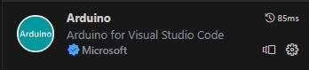
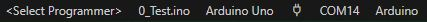

# Arduino 0_环境配置

## 1. 下载 Arduino IDE

Arduino IDE 下载官网：https://www.arduino.cc

下载并安装即可。

## 2. VScode Arduino 环境配置

1. 下载插件



2. 在工作空间中使用VSCode打开`xxx.ino`文件夹。VSCode会自动识别文件。随机生成隐藏文件夹`.vscode`，在其中有一个配置文件`arduino.json`。
3. 
4. 在`arduino.json`中添加

```json
"output": "./build",
```

用来指定编译文件目录，提高编译效率。

5. 在VScode下方选择烧录方式，开发板型号，串口号。



6. 输入以下测试代码

```c
int led = 13;

void setup() {
  // put your setup code here, to run once:
  pinMode(led,OUTPUT);
}

void loop() {
  // put your main code here, to run repeatedly:
  digitalWrite(led,HIGH);
  delay(1000);
  digitalWrite(led,LOW);
  delay(1000);  
}
```

编译并下载，如果看到LED闪烁则配置完成。